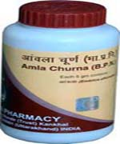

# Divya Amla Churna

[TOC]

Divya Amla Churna is prepared from amla powder. [Amalika](Amalika.md) is used as an ancient herb for the treatment of digestion problems. It is traditionally believed to be an excellent herb for constipation and other digestion problems. Amla consists of natural vitamin C that acts as an anti-oxidant and prevents formation of free radicals. Amla is known for ages and used in Indian homes for prevention of respiratory diseases. It helps to boost up the immunity and prevents recurrent attacks of infection. Amla gives quick relief from digestive disorders as it helps in balancing the pH of the stomach. Amla is known to prevent recurrent attacks of respiratory infection as it is a natural source of vitamin C.

## Benefits of Divya Amla Churna
1. Divya Amla Churna is a wonderful natural remedy for the treatment of constipation and other digestion problems
1. Divya Amla Churna gives quick relief from heartburn and acidity.
1. Divya Amla Churna is a natural source of vitamin C and prevents recurrent attacks of respiratory infection.
1. Divya Amla Churna consists of amla which acts as an anti-oxidant and prevents harmful effects of free radicals.
1. Divya Amla Churna helps in boosting the immune system and it also helps in the prevention of infectious diseases.
1. Divya Amla Churna helps in detoxification of the body as it helps in removing waste chemicals form the body.
1. Divya Amla Churna consists of amla which is a very good natural herb for rejuvenating hair. It provides natural shine and strength to the hair.
1. Amla is an excellent product for skin problems. It helps in rejuvenating skin cells and produce freshness on the skin. It helps in removal of dead cells from the skin.

## Therapeutic uses
1. Amla has been used since ages for the preparation of ayurvedic remedies as it is a very good product for the digestion problems. It helps in the treatment of digestion problems such as constipation, acidity and heartburn. Amla consists of anti-oxidants that rejuvenates the cells of the body and prevents formation of free radicals.
1. It consists of natural vitamin C that boosts up the energy and immunity of the body.

## Direction of use:
* It is recommended to take one tea spoon of amla two times in a day with luke warm water to obtain effective and quick results.

## How long to take it?
1. Divya amla churna is made up of amla that help in the treatment of digestion problems. It is a wonderful remedy for all the digestive disorders. It may be taken regularly for normal functioning of the digestive system. You may take this natural remedy for the treatment of digestive disorders. It regulates the functioning of digestive organs.
1. Diet recommendations
1. Diet changes may be done to done to get quick results from this herbal remedy. It is a wonderful natural remedy for digestive disorders as it stimulates the functioning of all digestive organs.
People suffering from digestion problems should avoid eating spicy and fried food as they may cause irritation to the lining of the stomach.
