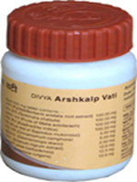

# Divya Arshkalp Vati

**Divya Arshkalp Vati** is a piles herbal remedy that helps in the treatment of piles. It is a natural remedy that prevents surgery and helps in natural piles cure. It is a wonderful piles herbal cure that does not produce any side effects and leads to complete restoration of health. This is a unique and well known piles herbal remedy that gives quick relief from piles. In conventional system, there is no cure for piles and many people are advised to go for surgery to get rid of pain and inflammation of the engorged veins. Piles are a common problem that occurs among men and women of any age. The most common cause of piles is prolonged sitting. People who have a sedentary life style suffer from pain and engorgement of the veins. Other causes of piles include eating too much spicy food, hereditary factor, constipation, etc. Thus, piles are a common problem but it may be solved by making some life style changes and taking this piles herbal remedy.Divya Arshkalp vati is a wonderful herbal product for the natural treatment of piles. It helps to save people from surgeon’s knife. People who do not want to undergo surgery for piles can take this herbal remedy to get rid of piles naturally. It gives quick relief from intense pain naturally. It is also a natural solution for other bowel disorders. The natural ingredients found in this product supplies proper blood to the veins and help to get rid of pain and swelling. It is an extremely useful and safe herbal remedy for the treatment of piles. The main cause of piles is constipation and this herbal product helps to address the root cause of the problem to give long lasting results. It helps to prevent complications that may arise due to chronic piles. It provides quick relief from pain, burning, inflammation and other symptoms associated with piles. The natural herbs in this product stimulate the normal functioning of the digestive system this reducing the chances of developing constipation.

## Benefits of Divya Arshkalp Vati
1. It is a unique piles cure for bleeding and non bleeding piles without producing any adverse effects.
1. This is a piles herbal cure that gives quick relief from pain and inflammation of the engorged veins.
1. Divya Arshkalp Vati helps to give relief from burning and stiffness of the rectum.
1. Divya Arshkalp Vati also helps in the treatment of anal fistula. It is a natural cure for fistula that produce no harmful results and also helps to avoid surgery.
1. Divya Arshkalp Vati also helps in excretion of toxic substances from the body and it helps in optimum functioning of the digestive system.
1. It is a wonderful herbal remedy for digestive problems such as diarrhea, dysentery, etc.
1. It provides strength to the veins and helps in removing engorgement of veins thus giving relief in pain and inflammation.
1. Divya Arshkalp Vati is a wonderful herbal remedy that helps in the treatment of digestive ailments and support normal functioning of other organs of the body.
