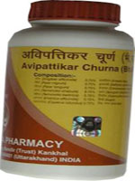

# Divya Avipattikar choorna

[TOC]

It is a combination of ayurvedic herbs recommended for gastrointestinal problems. It is a wonderful blend of natural traditional ayurvedic herbs that help in the acidity treatment. It consists of natural herbs that balances the pH of stomach and helps to relieve acidity. The natural herbs used in this natural product are believed to reduce the formation of acid in the stomach and helps in the hyperacidity treatment. It helps in complete digestion of the food and helps to prevent gas formation. Divya Avipattikar choorna also helps in other digestive ailments such as constipation, diarrhea, indigestion, etc. The main ingredient in this product is amla which is believed to be very beneficial natural treatment for digestive disorders. Amla consists of anti-oxidants that fight against the unwanted elements in the body.

## Benefits of Divya Avipattikar choorna
1. Divya Avipattikar choorna helps in acidity treatment. It balances the pH of the stomach and helps in digestion of the food properly.
1. Divya Avipattikar choorna is a wonderful heartburn remedy that maintains the acid base balance in the body.
1. Divya Avipattikar choorna activates the action of gastrointestinal enzymes for proper digestion of the food.
1. Divya Avipattikar choorna is an appetizer and helps in increasing the appetite.
1. Divya Avipattikar choorna is also beneficial in the constipation and other digestive disorders. It helps in removal of toxic substances from the blood and helps in detoxification of the body.
1. Divya Avipattikar choorna stimulates the functioning of liver and other digestive organs for proper metabolism of the food.
1. Divya Avipattikar choorna prevents formation of acids by stimulating the action of enzymes for complete digestion of the food.

## Therapeutic uses
Divya Avipattikar choorna is a wonderful remedy for digestive disorders. It helps in acidity and hyperacidity treatment. It gives a quick relief from heart burn. It sooths the lining of the gastrointestinal tract and gives quick relief from acidity.
It also helps in the treatment of piles and constipation. It boosts up the energy and cleanses the body from toxic chemicals.

## Direction of use
It is recommended to take Divya Avipattikar choorna after meals.
Three to six teaspoons should be two times in a day, morning and evening with cold water. It can also be taken with lukewarm water or with coconut water. One may take it before going to bed at night.

## How long to take it?
Divya Avipattikar choorna is made up of natural herbs that help in the acidity treatment. It is a wonderful remedy for all the digestive disorders. It may be taken regularly for normal functioning of the digestive system.
Therefore, there is no recommended time period for which the product has to be taken. It may be taken regularly as it does not produce any side effects for prolonged period.
