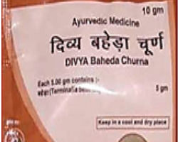

# Divya Baheda Churna

**Divya Baheda churna** is a very good combination of natural herbs and it is believed to provide nutrition to different parts of the body for optimum functioning. Divya baheda churna is a very good natural remedy for the treatment of nervous disorders such as anxiety, insomnia, stress, depression, etc. Divya baheda churna provides natural nutrients to brain cells and prevents stress, insomnia, depression and anxiety. All the herbs found in Divya baheda churna are natural and produces a sedative effect on sympathetic nervous system. It is a very good natural product that helps in the treatment of mental health diseases and other psychotic problems. Divya baheda churna is a comprehensive combination of ayurvedic herbs and all these herbs have a different action on different parts of the body. These herbs are found to be effective when used individually for various diseases.

## Advantages
Divya baheda churna is a natural ayurvedic product and all the herbs are natural and do not produce any side effects. It nourishes the body cells and increases the body’s immunity against various diseases. Divya baheda churna may be taken regularly for a prolonged period of time as it is absolutely safe. This natural and safe remedy provides life long relief from insomnia and other nervous system disorders. The herbs present in Baheda churna helps in rejuvenating the brain cells and increase the oxygen supply to the brain cells for optimum functioning. Divya baheda churna is a natural herbal produce for respiratory problems. It is an effective natural product recommended for various respiratory problems such as asthma, bronchitis and other inflammatory diseases of the lungs.
