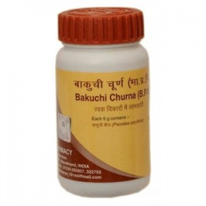

# Divya Bakuchi Churna

**Divya bakuchi churna** is a combination of herbal remedies that is used for the skin ailments. Bakuchi churna is made up of traditional ayurvedic herbs that are known for their anti-inflammatory properties. It helps in the quick healing of skin diseases without producing any side effects. Divya bakuchi churna is an ideal combination of natural herbal remedies that helps in the treatment of any kind of skin diseases. Divya bakuchi churna provides nourishment to the skin cells and helps in rejuvenating the cells. Divya bakuchi churna is a very good natural product for respiratory diseases. It helps to support the normal functioning of the respiratory organs and helps in the prevention of infectious diseases as it possesses anti-inflammatory properties. Divya bakuchi churna consists of natural ayurvedic herbs and produces effective results in the treatment of inflammatory diseases of any part of the body. The natural herbs in Divya bakuchi churna increases immunity of the body and prevents recurrent attacks of infection. The natural herbs of Divya bakuchi churna provide nourishment to the body cells and it energizes the body cells. It is a natural tonic for body that boosts up the immune system and provides energy to the cells to fight against any infection.

## Advantages
Divya bakuchi churna supports the respiratory organs of the body and does not produce any adverse side effects on any other organ of the body. The most important advantage of Divya bakuchi churna is that it is safe and effective for long term use. Divya bakuchi churna may be used at any age and continued for a longer time to prevent infection. Divya bakuchi churna does not contain any artificial substance that may prove harmful effects on the body. Divya bakuchi churna does not produce any allergic reactions in sensitive people. The herbs used in Divya bakuchi churna are well known for their action on body cells. It is a wonderful natural remedy for skin ailments and rejuvenates the skin cells. It gives fresh and clean appearance to the skin by providing essential nutrients to the skin cells. Divya bakuchi churna consists of herbs that are traditionally used for treatment of infectious skin diseases and diseases of the other organs.
