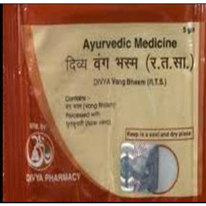

# Divya Bang Bhasm

**Bang Bhasma** is a powerful natural remedy used for the treatment of urinary disorders and general weakness. This natural product provides strength to body cells and helps in the treatment of general weakness. It is a very good remedy indicated for people with general body weakness. Bang bhasm is also found to be an effective natural product for genito-urinary disorders. This [Ayurvedic medicine](../../concepts/Ayurvedic_medicine.md) is found to be effective for the treatment of loss of strength and general weakness of the body. It provides nourishment to the body cells and provides strength to the whole body for effective functioning. Bang bhasm is also an effective ayurvedic remedy for sexual disorders in men. It improves sexual strength and prevents sexual debility in men. Bang is a metal which is used in its pure form for the preparation of effective ayurvedic remedy for the treatment of various diseases. Bang bhasm provides strength to the internal organs by providing nutrients to the body cells thus improving overall health of an individual.

## Advantages
Bang bhasm is a natural product and does not produce any side effects even of taken regularly for a prolonged period of time. Bang bhasm is a natural metal which is used in non-toxic form for the preparation of this ayurvedic remedy. It provides natural nourishment to the body cells and increases body strength to fight against diseases naturally. It is an excellent natural product for increasing the immunity of the body. Bang bhasm rejuvenates the body cells and improves functions of different body organs naturally. Person of any age may start taking this natural product as it is absolutely natural and safe. It provides natural strength to the body parts for effective and functioning of different body systems. Bang bhasm is an effective ayurvedic product that helps in the treatment of genitor-urinary disorders and general weakness of the body.
