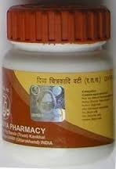

# Divya Chitrakadi Vati

**Divya Chitrakadi vati** is a natural remedy for indigestion. It is a natural treatment of **anorexia**. *It is an herbal remedy for gas*. It is a wonderful natural treatment for improper digestion of the food. People who suffer from gas and indigestion can take this herbal remedy to get rid of the problem. It is a wonderful natural remedy for indigestion. This is a natural treatment of anorexia that does not produce any side effects. This natural remedy for gas may be taken every day for proper digestion and absorption of the nutrients. People who suffer from gas and indigestion should take herbal remedy everyday for proper functioning of the digestive organs. It stimulates the lining of the stomach and helps to balance the pH of the stomach. It also helps in producing enzymes and chemicals that help in proper food digestion. This also helps in improving the appetite of a person. It acts on the stomach lining and also improves the functioning of the stomach. It may be taken regularly by the people who suffer from any kind of digestion problems.

## Benefits of Divya Chitrakadi vati.
* This natural remedy for indigestion has many other benefits. It is a remedy for gas formation and helps to get rid of the problem of indigestion.

1. This herbal remedy also helps to improve the digestive functions. It works continuously to stimulate the normal functioning of the digestive organs.
1. It is a wonderful remedy that helps to improve the appetite of a person. This herbal remedy helps in proper digestion of the food.
1. It also helps to prevent gastric ulcers as it stimulates stomach to secrete normal amount of hydrochloric acid. It prevents acidity, flatulence and other symptoms as well.
1. It is a veryd remedy for constipation. People who suffer from chronic problem of constipation can take this herbal remedy to get quick relief.
1. It is an excellent natural remedy for the treatment of all kinds of digestive problems. It is safe and effective herbal remedy.
1. It helps to get relief from obesity as it improves the functioning of the digestive system. It is also a good remedy for anorexia.
