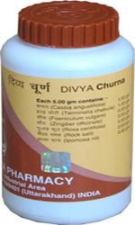

# Divya Churna

**Divya churna** is a well known herbal remedy for the treatment of constipation. It consists of herbs for constipation that helps to stimulate the activity of the digestive organs and facilitate easy movement of waste material out of the body. Men and women suffering from chronic constipation may take this herbal cure for constipation. Divya churna helps in natural cure constipation without producing any adverse effects. All the herbs for constipation that are used in this product are safe and well known for their action on the intestines where absorption of food takes place. This is a true herbal cure for constipation that not only helps to improve digestive health but also helps in the improvement of functions of other parts of the body. The herbs present in this product helps in the removal of waste products from the body. All the toxic elements are excreted out from the body by using this remedy regularly. People suffering from chronic constipation may take this natural cure for constipation to get rid of their signs and symptoms without getting any unwanted effects.

## Benefits of Divya churna
1. Divya Churna is a wonderful and unique amalgam of ayurvedic herbs for constipation that is used for the treatment of chronic constipation for all individuals.
1. Divya churna produces excellent results in all individuals suffering from chronic constipation irrespective of age. It may be taken regularly for a longer time period as it is natural and safe.
1. Divya churna also helps to improve the functioning of all digestive organs and prevent gastric ailments.
People who take this natural remedy everyday do not suffer from any gastric complaints as it helps to support normal functioning.
1. Divya churna helps in the secretion of digestive enzymes that helps in proper digestion of the food. It also helps in proper assimilation and absorption of food so that waste material is excreted out from the body.
1. Divya churna is a natural cure for constipation and is also helps in the treatment of other symptoms associated with constipation such as bloating of abdomen, flatulence, pain and sour eructation.
1. People suffering from acidity of the stomach due to increased secretion of hydrochloric acid from the stomach may also take this remedy to get rid of long standing problem of acidity.
1. Divya churna provides strength to the digestive muscles and supports normal working of all digestive organs for effective digestion of different food products.
