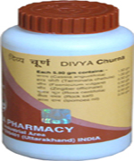

# Divya Gashar Churna

[TOC]

Divya Gashar Churna is a blend of ayurvedic herbs that helps in the treatment of gastric disorders. It is a wonderful combination of natural herbs that help to give relief from gastrointestinal problems. It helps in the digestion of food. It gives quick relief from acidity and heartburn. It is a very good herbal remedy for colic pain, flatulence and heaviness of abdomen. Severe stomach gas problem causes uneasiness and discomfort. But Divya gashar churna helps to give quick relief from gastric disorders. It is a natural way of getting rid of gastrointestinal problems. All the herbs in divya gashar churna are natural and they help to support gastric organs to function optimally. It helps in complete digestion of the food and gives relief from acidity and heartburn. It is also a good remedy for people who have decreased appetite. It stimulates the functioning of gastric organs and prevents constipation and diarrhea.

## Benefits of Divya Gashar Churna
1. Divya Gashar Churna is a wonderful herbal remedy for the digestion of food and it helps to relieve acidity and heartburn.
1. Divya Gashar Churna promotes complete digestion of food and gives relief from gastrointestinal problems.
1. Divya Gashar Churna helps to increase the appetite and promotes healing of gastric ulcers.
1. Divya Gashar Churna is a very good remedy for constipation and diarrhea.
1. Divya Gashar Churna is the best suitable remedy for people suffering from gastrointestinal problems.
1. Divya Gashar Churna prevents formation of gas and reduces heaviness of the abdomen.

## Therapeutic uses
1. Divya Gashar Churna is a natural herbal remedy for the treatment of gastrointestinal problem. It helps to give quick relief from gas and heaviness of the abdomen. It is a wonderful herbal remedy that helps in the treatment of acidity and heartburn. It is suitable remedy for people who suffer from gastrointestinal Problems.
1. Divya Gashar Churna stimulates the digestion of food and gives quick relief from stomach gas problem.

## Direction of use
1. Divya Gashar Churna is to be taken after food with Luke warm water. It may be taken any other time if problem of gas and flatulence arise.
One teaspoon of Divya Gashar Churna is to be taken two times in a day.

## How long to take it?
Divya Gashar churna is made up of natural herbs that help in the gastric disorders. It is a wonderful remedy for all the digestive disorders. It may be taken regularly for normal functioning of the digestive system. It does not produce any side effects even if taken regularly for a prolonged period of time.
