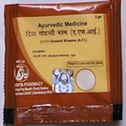

# Divya Godanti Bhasm

**Divya godanti bhasm** is a combination of natural herbs indicated for headache of any type and origin. Godanti bhasm is a product obtained from gypsum. Gypsum is found to be an essential product for healing of wounds. Divya godanti bhasm is also found to be an effective remedy for controlling blood glucose level in people suffering from diabetes. It is a wonderful natural remedy for high cholesterol and inflammatory diseases of the body.
Divya godanti bhasm is an effective immune stimulant that helps in fighting against inflammatory diseases without producing any side effects. Divya godanti bhasm helps in the treatment of digestive disorders. It is a very good natural remedy for inflammatory bowel disease as it possesses anti-inflammatory properties. Divya godanti bhasm helps to boost up immunity and provides energy to body cells. It also helps in quick recovery from any inflammatory diseases in the body. It is a good natural remedy for skin diseases and prevents inflammatory diseases of the skin. It provides nourishment to the skin cells and rejuvenates the whole body.

## Advantages
Divya godanti bhasm is a safe and effective natural remedy for controlling blood sugar and cholesterol levels. Gypsum is used in minute quantity such that it produces therapeutic effects in body. Divya godanti bhasm can be safely used for the treatment of various types of body disorders. Divya godanti bhasm is a wonderful natural remedy that does not produce any side effects when used for a prolonged period of time. Divya godanti bhasm can be safely used by people of any age as it is natural and herbal. It provides immunity to body cells and prevents recurrent infections of body. Divya godanti bhasm does not consist of any artificial ingredients that may produce any kind of side effects. Divya godanti bhasm when taken regularly helps to control blood sugar and cholesterol level. Divya godanti bhasm is known to possess anti-inflammatory and healing properties that help in the prevention of recurrent body infections. It helps in cleansing the blood from harmful substances without affective functioning of other body organs.
