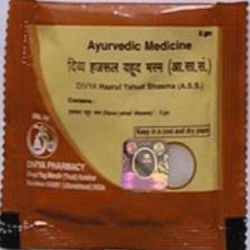

# Divya Hajrul Yahud

**Divya hajrul yahud** is a natural product recommended for kidney stone. Other name for hajrula yahud is stony olive. It is an excellent product for urinary disorders. Divya hajrul yahud naturally helps in breaking the kidney stones into smaller fragments which are easily removed from the urinary tract with passage of urine. Divya hajrul yahud is a comprehensive natural remedy for any kind of urinary obstruction or any other urinary disease. It provides nourishment to kidney cells and supports their normal functioning. Divya hajrul yahud is a wonderful natural formulation and is found to be effective in urinary infection of any kind. Divya hajrul yahud is recommended for pain while urinating, benign prostate enlargement, suppression of the urination, stones in the urinary tract, infection caused by the stones, syphilis, gonorrhea etc. Divya hajrul yahud is also a very good product given for urinary stones. Divya hajrul yahud helps in the elimination of the stones from the urinary tract naturally and helps to reduce pain and discomfort associated with presence of stones in ureters or any other part of the urinary system.

## Advantages
Divya hajrul yahud is a natural product and all the ingredients of this comprehensive remedy are natural and do not produce any side effects. Divya hajrul yahud may be taken for prolonged period of time for the removal of stones from the urinary system without producing any side effects. Divya hajrul yahud gives permanent relief from all urinary system diseases. It decreases the pain and inflammation of the urinary organs very quickly and you do not have to take this product for your whole life. Divya hajrul yahud is known to possess anti-inflammatory and anti-bacterial properties due to which it is an excellent product for the treatment of recurrent urinary tract infections. Divya hajrul yahud acts on the stones present in the kidneys and break them into smaller fragments for easy removal from the urinary tract. Divya hajrul yahud also help to boost the immune system and prevent recurrent attacks of infection. It supports kidney for normal functioning and producing sufficient amount of urine.
