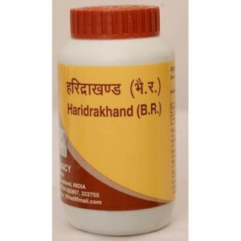

# Divya Haridrakhand

**Divya haridrakhand** is a blend of natural remedies that help in the treatment of chronic cough and cough. The main herb found in this natural remedy is turmeric. Turmeric has been traditionally used in Indian homes for the treatment of allergic respiratory infections. Turmeric is also believed to be an excellent herb for skin diseases such as urticaria. Turmeric helps to eliminate toxic substances from the blood and helps in its purification. Thus, Divya haridrakhand is a natural remedy that helps in cleansing the blood and prevents skin diseases. All other ingredients in this natural product are natural and do not produce any harmful effects. Divya haridrakhand is a comprehensive combination of ayurvedic herbs that prevents allergic reactions. Divya haridrakhand helps to prevent inflammatory diseases in the body as turmeric is known to possess anti-inflammatory properties. Turmeric acts as a natural antibiotic and prevents inflammation of wounds. It is a very good herbal remedy for the treatment of wounds and skin affections. Divya haridrakhand is a blood purifier and it cleanses the blood by removing toxic elements.

## Advantages
Divya haridrakhand is a natural herbal product and absolutely safe for long term use. Its effectiveness lies in the fact that it is made up of natural herbs that are used since ancient time for the treatment of many inflammatory diseases. Divya haridrakhand is a very good remedy for allergic rhinitis, cough and cold. It stimulates the functioning of respiratory cells and helps in removal of mucus from the lungs. All the ingredients are known for their curative and healing properties and do not produce any unwanted side effects when used for a longer period of time. Divya haridrakhand is easily absorbed by the body and it helps to boost up the immunity. The main ingredient turmeric is a natural immune booster that helps to provide energy and immunity to the body cells. People suffering from recurrent attacks of fever or respiratory problems may take this natural product regularly to get rid of their ailment forever.
