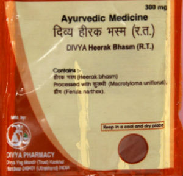

# Divya Hirak Bhasm

**Divya hirak bhasm** is a natural product. Hirak bhasm is prepared from the most valuable and hardest substance that is diamond. It is traditionally believed to provide strength and immunity to the body. Hirak bhasm is well known for its action of the muscles of the heart and it also helps to improve general weakness of the body. Hirak bhasm is found to be useful for different ailments such as arthritis, bone disorders, etc. The most important therapeutic effect of this natural product is found in the treatment of deadly disease called as cancer. Divya hirak bhasm is a valuable natural product for the treatment of any type of cancer. Cancer may be defined as unwanted growth of cells in any part of the body. In later stage it becomes life threatening. Cancer is named on the basis of body parts involved or type of cells involved. Generally, in conventional system chemotherapy and radiation therapy are given for the treatment of cancer which produces a lot of side effects. Natural medicines such as in ayurvedic system, different remedies are prepared which may be sued for the treatment of cancer without getting any side effects. Divya hirak bhasm is one such natural [Ayurvedic medicine](../../concepts/Ayurvedic_medicine.md) that is used for the treatment of any kind of cancer in the body.

## Advantages
The most important advantage of divya hirak bhasm is that it is natural and safe and does not produce any side effects even if it is taken for longer duration of time. Divya hirak bhasm is a natural ayurvedic product which is proved to be very useful in the treatment of cancer to avoid the side effects produced by chemotherapy and radiation therapy. Divay hirak bhasm helps in reducing the size of the tumor, it also helps in preventing the spread of cancerous cells to other parts of the body and this natural product directly acts on the affected cells without altering the healthy cells of the body. Thus, this natural product helps in cancer treatment naturally without producing any harmful effects on other parts of the body.
