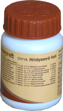

# Divya Hridyamrit Vati

**Divya Hridyamrit Vati**' is a unique remedy for heart diseases. It is a natural cure for heart diseases. The natural remedies for heart included in this product are safe and do not produce any side effects. It is a heart disease herbal treatment and provides strength to the muscles of the heart for normal functioning. It is the best product for people who suffer from heart diseases and do not want to take other conventional remedies. If taken early it prevents development of complications. The natural remedies for heart used in this product provide natural nourishment to the muscles of the heart. These natural heart remedies also help to boost p the immune system and prevent complications related to heart diseases. People suffering from heart diseases may start taking this product as it is a natural cure for heart disease. Regular intake of this remedy may help to avoid any cardiac surgery. It is believed to be the best heart disease herbal treatment for people after the age of forty. The natural remedies for heart in Divya Hridyamrit Vati stimulate normal functioning of the heart.

## Benefits of Divya Hridyamrit Vati
1. Divya Hridyamrit Vati is believed to be an excellent herbal remedy for heart. It helps to prevent heart diseases by stimulating normal heart functioning.
1. Divya Hridyamrit Vati is beneficial for people who are already suffering from chronic heart problems. It may be taken along with other conventional remedies to boost up the immune system.
1. Divya Hridyamrit Vati is useful for all types of heart diseases such as angina, coronary heart disease, valvular disease of the heart, myocardial infarction, etc.
1. Divya Hridyamrit Vati consists of natural remedies for heart and gives relief from symptoms associated with heart diseases quickly without producing any side effects.
1. Divya Hridyamrit Vati may be taken every day as prescribed to get effective results. In some cases it is found that people who start taking this product do not have to go for heart surgery.
1. All the remedies are herbal and do not produce any unwanted effects on other organs of the body. But it stimulates the supply of blood to all parts of the body effectively.
1. Divya Hridyamrit Vati helps to prevent heart attack in people who have family history or have high [Blood pressure](../../concepts/Blood_pressure.md) and stress.
1. Divya Hridyamrit Vati offers excellent results to people of suffering from heart diseases when they take this product regularly to rejuvenate their heart.
