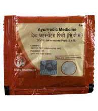

# Divya Jahar Mohra Pishti

**Divya Jahar mohra pishti** is a natural product prepared from the powder of the serpentine orephite. This natural ayurvedic product is a rich source of calcium. This natural drug is indicated for several gastric disorders such as acidity, heart burn, indigestion and excessive heat of the body. It is a very good natural product indicated for heart and liver diseases. Divya jahar mohra pishti is also a very good ayurvedic product recommended for brain disorders. It provides natural nourishment to brain cells and helps in optimum functioning of all the organs. This natural product heals the gastric mucosa naturally and helps in digestion. Divya jahar mohra pishti is a very good product for improving appetite and digestive disorders. It balances the secretion of acid from the stomach and gives quick relief from acidity and heartburn. Divya jahar mohra pishti provides nutrients to the lining of the stomach and helps in its normal functioning. Regular intake of divya jahar mohra pishti helps in proper digestion of all the ingredients of food and leads to healthy functioning of all the body parts.

## Advantages
Divya jahar mohra pishti is a natural [Ayurvedic medicine](../../concepts/Ayurvedic_medicine.md) which does not produce any unwanted effects. It may be safely taken for prolonged period of time to get rid of various diseases such as heart problems, liver disorders, brain disorders, digestive disorders, etc. This single natural product is useful for number of diseases and may be taken regularly to get beneficial results. Divya jahar mohra pishti provide natural calcium to the body and helps in regulating the functioning of the muscles of the heart. It also provides natural calcium to the bones and increases their strength. Divya jahar mohra pishti is free from any side effects and is traditionally prepared from natural substance obtained from serpentine orephite. It is traditionally believed to provide nourishment to body parts for healthy functioning. Most important advantage of this natural ayurvedic product is that it is absolutely safe.
