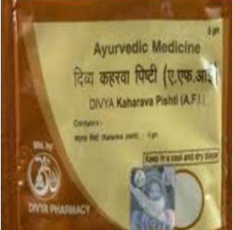

# Divya Kaharava Pishti

**Divya kaharava pishti** is a natural [Ayurvedic medicine](../../concepts/Ayurvedic_medicine.md) recommended for menstrual disorders in women. The natural herbs present in this ayurvedic product helps to provide nourishment to female reproductive organs and help in their normal functioning. Divya kahavara pishti is wonderful ayurvedic remedy indicated for all diseases related to female reproductive organs. Divya kaharava pishti is a safe natural product indicated for menstrual disorders in women such as dysmenorrheal, menorrhagia, amenorrhea, polycystic ovarian syndrome, fibroid uterus, dysfunctional uterine bleeding, leucorrhea, infertility, etc. Divya kaharava pishti helps in providing natural nutrients to the reproductive organs of women and helps in the treatment of menstrual disorders without producing any side effects. Women may take this natural product for longer periods of time to get rid of menstrual irregularities and for balancing female hormones. All the ingredients in Divya kaharava pishti are natural and it is a very good product for all the discomforts associated with menstrual disorders. Divya kaharava pishti gives relief from excessive bleeding, tiredness, weakness and other complaints felt during menstrual periods.

## Advantages
Divya kaharava pishti is made up of natural ingredients and it is a safe product which may be taken regularly to get rid of any kind of menstrual disorder. Divya kaharava pishti may be taken at any age as it is safe and does not produce any side effects. It is not a hormonal product but it balances all the female hormones for normal functioning of all the female reproductive organs. Divya kaharava pishti provides natural nourishment to body cells and female organs for optimal functioning. Divya kaharava pishti naturally helps in balancing all the hormones and gives relief from symptoms associated with menstrual disorders such as pain in back, tenderness of breast, irritability, weakness, loss of sleep, tiredness, nausea, vomiting, etc. Divya kaharava pishti is a comprehensive natural product for proper functioning of all the female reproductive organs. Divya kaharava pishti is safe and does not produce any harmful effects on other organs of the body.
