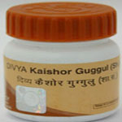

# Divya Kaishor Guggulu

[TOC]

Divya Kaishor Guggulu is an ayurvedic formula for blood cleanse. It is an active blood purifier and helps to take care of skin diseases. Kaishor guggulu is the main ingredient of this herbal product that helps in the purification of the blood. According to the ayurvedic principles it is believed to remove excessive pitta (fire) from the body and thus helps in giving clean and soothing relief to the skin. It helps in removing impurities from the blood and makes your blood pure and clean. Divya Kaishor Guggulu helps in the treatment of skin diseases that may be produced to blood disorders. It is a wonderful natural skin care product that gives natural glow and fairness to your skin. Divya Kaishor Guggulu is known for its anti-inflammatory and antiseptic properties which makes it a wonderful herbal remedy for skin diseases.

## Benefits of Divya Kaishor Guggulu
1. Divya Kaishor Guggulu helps in blood cleanse and removing chemicals from the blood. It helps to prevent inflammatory diseases of the skin.
1. Divya Kaishor Guggulu is a natural blood purifier that provides natural glow and shine to the skin by removing harmful pollutants from the skin.
1. Divya Kaishor Guggulu provides natural protection to the skin from the harmful rays of the sun. It boosts up the internal immunity of the body to resist the damage that may be produced due to UV rays of the sun.
1. Divya Kaishor [Guggulu](../../medicines/Guggulu.md) purifies your blood and gives relief from inflammatory diseases of the skin such as eczema and psoriasis.
1. Divya Kaishor Guggulu is also a wonderful product for people suffering from recurrent attacks of acne and pimples.
1. Divya Kaishor Guggulu is also useful in giving natural glow and shine to the skin by providing essential nutrients to the skin.
1. Divya Kaishor Guggulu is also useful for other inflammatory diseases such as diseases of bones and joints.
1. Divya Kaishor Guggulu is a natural remedy that helps to look young and active. It keeps your skin fresh and clean.

## Therapeutic uses
1. Divya Kaishor Guggulu is a wonderful natural skin care product that provides complete protection to your skin from harmful and inflammatory skin diseases. It provides natural nutrients to the skin to make it healthy.
1. Divya Kaishor Guggulu is anti-inflammatory and helps to reduce pitta from the body for complete cleansing of the blood.
1. Divya Kaishor Guggulu is also a very good remedy for gout and arthritis and other diseases of the bones and joints.

## Direction of use:
One to two tablets of Divya Kaishor Guggulu should be taken once in a day. Take this remedy with hot water/ milk.

## How long to take it?
1. There is no specific time period for which this remedy has to be taken. It may be taken for a long period of time as it is free from any side effects.
1. Diet recommendations
1. Diet and herbs are important for removing toxic elements from the body. After removing the toxic substances the cells of the body get rejuvenated. It is recommended to make necessary diet recommendations to achieve the results of product early.

* Some of the important diet recommendations include
1. Fruits and vegetables helps to boost up the immunity. Fruits such as apple, Papaya, orange are excellent for skin diseases.
1. It is recommended that people with skin diseases should increase uptake of fluids to remove toxic substances from the body.
1. Avoid eating fried and junk foods as they may aggravate skin problems.
Precautions
1. It is one of the safe herbal remedies for skin problems. The only precaution to be taken while taking this remedy is that it should be taken with hot water/milk.
