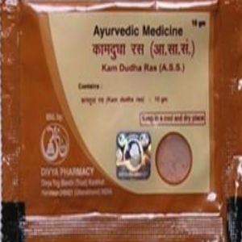

# Divya Kamdudha Ras

Divya Kamdudha Ras is a natural [Ayurvedic medicine](../../concepts/Ayurvedic_medicine.md) recommended for mental calmness. This natural product is indicated for mental excitement such as ADHD/ADD. It is a natural treatment for ADHD/ADD as the natural ingredients of this remedy helps to calm the brain cells thus producing a soothing effect. ADHD/ADD is a hyperactivity disorder usually seen in children due to hyperactivity of the brain cells. It may also progress with advancing age. Child suffering from ADHD/ADD becomes restless and hyperactive. He does not sits at one place, keeps moving here and there and indulge in violent activities due to hyperactivity of the brain cells. The natural ingredients of Divya kamdudha ras provides calmness to the brain cells and helps in the natural treatment of ADD/ADHD. It is a safe and natural product and does not produce any side effects on the brain cells with continuous use. This natural ayurvedic product naturally helps in the normal functioning of the brain cells by providing essential nutrients and removing the pitta dosha from the body.

## Advantages
All the ingredients used for the preparation of Divya kamdudha ras are natural and do not produce any side effects even if used for a prolonged period of time. Divya kamdudha ras is a safe natural remedy for children suffering from ADD/ADHD. Divya kamdudha ras naturally provides nutrients to the brain cells and help in producing calming effect. Divya kamdudha ras is a wonderful natural Ayurvedic product that helps to remove pitta dosha from the body and increases the vitality and strength of the body. This natural ADD/ADHD treatment is a wonderful alternative for conventional remedies. Conventional remedies indicated for ADD/ADHD may produce harmful effects on brain whereas this natural remedy is absolutely safe and does not produce any side effects. Divya kamdudha ras provides natural nutrients to the brain cells for proper functioning of all the organs. Divya kamdudha ras is a comprehensive ayurvedic remedy for weakness of brain and other pitta disorders. Divya kamdudha ras gives natural relief from mental excitement and anxiety by producing a soothing effect on the brain cells.
