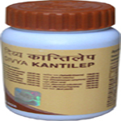

# Divya Kanti lep

[TOC]

Divya Kanti lep is an herbal combination that helps to get rid of skin problems. It is an excellent herbal remedy for dark spots on the face, acne, pimples, etc. Regular use of Divya Kanti lep is helpful in giving you a shining face. Divya Kanti lep is a blend of ayurvedic herbs that are traditionally believed to remove face dark spots naturally by providing essential nutrients. It helps to rejuvenate the skin cells by essential minerals and vitamins. It helps to remove toxic substances from the blood and makes your skin clear and healthy. All the herbs used in Divya Kanti lep are natural and do not produce any side effects. This herbal remedy is beneficial for all the diseases of the skin. It makes your skin clear and healthy by removing all the toxic chemicals from your blood.

## How to use:
Mix two teaspoon of Divya kanti lep with rose water or simple water to form a paste. Apply this paste all over your face and leave it for 10-15 minutes. Rinse your face with fresh water. You will feel rejuvenated and it will give you fresh look.

## Benefits of Divya Kanti lep
1. Divya Kanti lep helps in the purification of blood and helps in the treatment of all the skin diseases.
1. Divya Kanti lep is the best natural treatment for acne, pimples and dark spots.
1. Divya Kanti lep is one of the best natural remedy for wrinkles as it provides nourishment to the skin cells and make your face glow and shine naturally.
1. Divya Kanti lep is a wonderful remedy for all types of chronic skin problems such as urticaria, eczema, psoriasis, etc.
1. Divya Kanti lep naturally helps to remove face dark spots by cleaning of the blood.
1. Divya Kanti lep helps to improve the skin tone by nourishing the skin with essential minerals and vitamins.
1. Divya Kanti lep is a wonderful remedy to remove the age related spots on the face. It is best remedy to prevent wrinkles.
1. Divya Kanti lep helps to give a young appearance to your face and helps to remove dark circles under the eyes.

## Therapeutic uses
1. Divya Kanti lep is an excellent herbal remedy for skin related problems. It gives you shining face with glowing appearance.
1. Divya Kanti lep helps to cleanse the blood from impurities and help to remove dark circles and face dark spots naturally and forever
1. It helps you to look younger and make your skin smooth and soft. It is one of the natural remedies for wrinkles.

## Direction of use:
1. Prepare a paste by adding one tea spoon full of Divya Kanti Lep with rose water or un-boiled milk. Apply it on the face and keep it for three to four hours and then wash with luke-warm water.

## How long to take it?
1. Divya Kantilep may be taken for prolonged period as it is prepared from natural herbs and is absolutely natural and safe. It does not produce any side effects even if taken for a long period of time.

## Diet recommendations
1. There are different causes of skin diseases. For some disease there is no specific cause and it may occur due to dietary discrepancies. Some important dietary changes that can help in the treatment of skin diseases are:
1. Drink plenty of fluids as it is necessary to wash out chemicals from the body. People who do not drink sufficient amount of water suffer from skin diseases more frequently.
1. A person should remain free from stress and anxiety. Stress is an important cause of skin diseases.
1. Some women suffer from skin diseases during menstrual cycle. Therefore, it is necessary to balance the hormones by eating a well balanced diet and doing regular exercise or yoga techniques.
1. Skin diseases result due to excessive intake of fried and junk food. Therefore, one should avoid eating too much junk and fried food.
