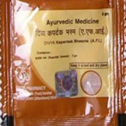

# Divya Kapardhak Bhasma

**Divya kapardhak bhasm** is a combination of natural ingredients and this bhasm is available all over India. Kapardhak bhasm is found in three different colors white, red and yellow. Yellow colored kapardhak is found to be effective for the treatment of various diseases. Kapardhak is found to be an effective natural remedy for the treatment of digestive disorders. This bhasm helps to boost up the immune system and prevent recurrent respiratory infections. Divya kapardhak is a natural product recommended for the treatment of infectious diseases. This bhasm is traditionally believed to posses anti-bacterial and anti-viral properties. Thus, this natural product helps in boosting the immune system and prevents infection. Divya kapardhak bhasm helps to wash out harmful toxins from the body and prevents infection. Divya kapardhak bhasm is a very good natural product for digestive disorders as it helps to cleanse the body system. It consists of traces of important minerals which help to provide mineral support to the body. By providing natural mineral it boosts up the immune system and does not produce any side effects. Thus, Divya kapardhak bhasm is a good source of natural minerals.

Advantages
Divya kapardhak bhasm is a natural product that helps to boost up the immune system and is a very good natural remedy to prevent infection. The most important advantage of divya kapardhak bhasm is that it does not produce any side effects and is a very good remedy for the treatment of digestive ailments. Divya kapardhak bhasm may be taken for a longer period for the treatment of digestive infection of any other infectious diseases as it is absolutely natural and safe. Divya kapardhak bhasm helps in natural cleansing of the body by removing toxins. This natural product has anti-bacterial and anti-viral properties due to which it helps to prevent any infection. It naturally helps in the purification of the blood by removing harmful toxic substances from the blood. Divya kapardhak bhasm is a natural substance and has been used since ancient time for boosting immune system and prevention of infection.
