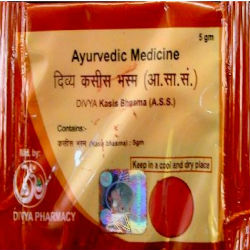

# Divya Kasis Bhasm

**Divya Kasis bhasm** is a natural product indicated for weakness and debility. There are two main types of this bhasm. One is named as pushp kasisa and other one is balu kasisa. Mainly these bhasm consist of sulphate of iron, therefore it is a very good natural product recommended for anemia and low blood count. Divya Kasis bhasm naturally helps in increasing the blood count and treats anemia without producing any side effects. It provides iron to the body in natural form. Divya Kasis bhasm is also indicated for the diseases of liver and spleen. This natural product acts on liver and spleen and supports their normal functioning. Divya Kasis bhasm provides essential minerals to the body for the formation of blood cells. Thus, it increases blood cell count and is a useful remedy for anemia and other blood disorders.

Advantages
The most important advantage of Divya Kasis bhasm is that it naturally helps in the treatment of anemia and other blood disorders. It provides natural minerals required for the formation of blood cells and treat anemia. It increases the hemoglobin content of the blood. Divya Kasis bhasm naturally helps in treating weakness and debility that may be caused due to low blood count of anemia. It naturally helps to boost up the immune system. Divya Kasis bhasm is a natural remedy which is composed of natural ingredients. Divya Kasis bhasm may be taken regularly to get quick beneficial results. Divya Kasis bhasm does not produce any side effects even if taken continuously for longer period. Divya Kasis bhasm helps in quick recovery. Divya Kasis bhasm is a natural remedy for the treatment of inflammation of any part of the body. It provides natural minerals and support normal functioning of liver and spleen.
