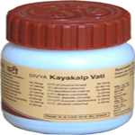

# Divya Kayakalp Vati

[TOC]

Divya Kayakalp Vati is an ayurvedic combination of herbs that helps to get rid of skin problems. It is an excellent herbal remedy for natural skin cure. Regular use of Divya Kayakalp Vati is helpful in giving you relief from acne and pimples. Divya Kayakalp vati is a blend of ayurvedic herbs that are traditionally believed to remove acne and pimples naturally by providing essential nutrients. It helps to rejuvenate the skin cells by essential minerals and vitamins. It helps to remove toxic substances from the blood and makes your skin clear and healthy. All the herbs used in Divya Kayakalp vati are natural and do not produce any side effects. This herbal remedy is beneficial for all the diseases of the skin. It makes your skin clear and healthy by removing all the toxic chemicals from your blood.

## Benefits of Divya Kayakalp Vati
1. Divya Kayakalp vati helps in the purification of blood and helps in the treatment of all the skin diseases.
1. Divya Kayakalp vati is the best natural sin cure for acne, pimples and dark spots.
1. Divya Kayakalp vati is one of the best acne natural remedy as it provides nourishment to the skin cells and helps to remove old acne scars.
1. Divya Kayakalp vati is a wonderful pimple natural cure.
1. Divya Kayakalp vati naturally helps to remove dark circles under the eyes and blemishes from the skin by cleaning of the blood.
1. Divya Kayakalp vati helps to improve the skin tone by nourishing the skin with essential minerals and vitamins.
1. Divya Kayakalp vati is a wonderful remedy to remove the age related spots on the face. It is best remedy to prevent wrinkles.
1. Divya Kayakalp vati helps to give a young appearance to your face and helps to remove fine lines.

## Dosage and administration
1. It is advised to take two tablets of Divya kayakalp vati, two times in a day after food with a glass of water.
Therapeutic uses
1. Divya Kayakalp vati is an excellent herbal remedy for skin related problems. It gives you natural skin cure.
1. Divya Kayakalp vati helps to cleanse the blood from impurities and help to remove acne and pimples from the face.
1. It helps you to look younger and make your skin smooth and soft. It is one of the best acne natural remedy.

## Direction of use:
1. Divya Kayakalp Vati should be taken twice in a day. Take empty stomach in early morning and one hour before dinner with fresh water.

## How long to take it?
This is a natural remedy and may be taken regularly without getting any side effects. It is safe to take for prolonged period as it does not produce any side effects.

## Diet recommendations
1. Diet plays an important part in eliminating harmful elements from our bodies. After eliminating the harmful ingredients the cells of our bodies get recharged. It is recommended to make necessary diet suggestions to achieve the results of product early. Some of the essential diet suggestions include:
1. Fresh fruits and vegetables are essential for providing essential nutrients to the skin.
1. Avoid consuming deep fried and unhealthy meals as they may worsen skin problems.
1. Increase intake of fluids to wash out the chemicals from the body.
1. Do not eat too much fried and junk food.
1. Eating too much processed and preserved food can also aggravate the skin problems.
