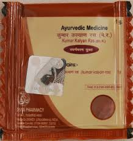

# Divya Kumar Kalyan Ras

**Divya Kumar Kalyan ras** is a combination of natural minerals and other important ingredients that helps in the treatment of diabetes naturally. It is a natural product indicated for controlling blood sugar naturally. Divya Kumar Kalyan ras is also a very good natural medicine for controlling blood cholesterol levels. It is a combination of essential amino acids and important minerals that makes it a useful remedy for various diseases. Divya Kumar Kalyan ras also acts as a preventive for inflammation anywhere in the body. All the ingredients of Divya Kumar Kalyan ras are natural and do not produce any side effects. Divya Kumar Kalyan ras is a very good natural product for obese people who suffer from diabetes and high blood cholesterol. Diabetes is a medical condition in which pancreas fail to produce enough insulin for the metabolism of glucose and people suffering from diabetes have to take anti-diabetic medicines for controlling blood sugar which may produce numerous other side effects. This natural remedy helps in controlling blood sugar naturally by providing essential nutrients and stimulating pancreas to secrete insulin for glucose metabolism.
