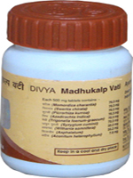

# Divya Madhu Nashini Vati

**Divya Madhu Nashini vati** is a natural herbal remedy for balancing blood sugar. It is wonderful herbal remedy that helps to cure diabetes. Divya Madhu Nashini is a diabetes herbal cure that helps in stimulating pancreas for the secretion of insulin to balance blood sugar. Divya Madhu Nashini vati is a diabetes ayurvedic cure as it is made up of important herbs that help in maintaining normal glucose level. Generally, there is two types of diabetes: type 1 diabetes that occurs mainly at younger age and pancreas fail to secrete any insulin and type 2 diabetes that occurs after middle age and in this type pancreas secrete little amount of insulin which is not sufficient to metabolize blood sugar. Therefore, people suffering from type 2 diabetes have to take medicines to control blood sugar. These remedies produce other side effects in the body whereas Divya Madhu Nashini is an herbal remedy for diabetes that helps to balance blood sugar without producing any side effects. Divya Madhu Nashini vati is a diabetes ayurvedic cure and is a well known herbal remedy that helps to get rid of diabetes naturally.

## Benefits of Divya Madhu Nashini vati
1. Divya Madhu Nashini vati is a wonderful diabetes herbal cure that helps in the treatment of diabetes in a natural way without affecting other organs.
1. Divya Madhu Nashini vati also helps in preventing complications that may be produced by high blood sugar in people suffering from diabetes.
1. Divya Madhu Nashini vati also helps to balance blood pressure and eliminate toxic substances from the urine for optimum functioning of the kidneys.
1. Divya Madhu Nashini vati also helps in preventing heart diseases and provides optimum blood supply to the heart for normal functioning.
1. Divya Madhu Nashini vati is a wonderful remedy to prevent infections. It helps to prevent eye complications by providing essential herbs.
1. Divya Madhu Nashini vati helps to rejuvenate the skin cells and give fresh looking and clean skin.
1. Divya Madhu Nashini vati also helps to boost up the immune system and prevent recurrent infections in people suffering from diabetes.
1. Divya Madhu Nashini vati also helps in controlling symptoms of diabetes such as frequent urination at night, excessive thirst, desire for eating sugar, etc.
1. Divya Madhu Nashini vati may be taken every day for a longer period of time as it is natural and herbal remedy for diabetes and does not produce any harmful effects.
