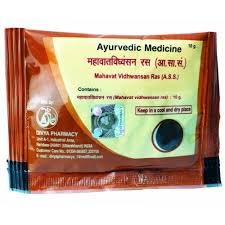

# Divya Mahawat Vidhwansan Ras

**Divya mahawat vidhwansan** is an herbal product useful for the treatment of joint pains It is a natural herbal product for diseases of joints. Divya mahawat vidhwansan is a very good natural product for arthritis, osteoarthritis, gout and other joint diseases. It provides natural nutrients to the cartilage and tendons and help in normal functioning of the joints. Divya mahawat vidhwansan consists of natural ingredients which are traditionally believed to useful for the treatment of joint diseasesThe natural herbs present in Divya mahawat vidhwansan provides nourishment to the joints and helps in strengthening the functioning of joints. Divya mahawat vidhwansan is a very good product recommended for old people who suffer from joint diseases due to advancing age. Divya mahawat vidhwansan may be taken regularly for normal movement of joints.
Arthritis and gout are common diseases affecting joints. Joints become red and painful that restricts normal movement. People suffering from arthritis and gout have to take non-steroidal anti-inflammatory remedies to reduce pain and stiffness in joints. Regular intake of these remedies may produce many side effects on other parts of the body. Divya mahawat vidhwansan is a natural herbal remedy for joint pains that nourishes the joints and gives quick relief from pain and stiffness without producing any side effects.

## Advantages
Divya mahawat vidhwansan is made up of natural herbs that are absolutely safe and do not produce any side effects. Divya mahawat vidhwansan is a natural remedy for joint pains and help to get rid of joint pains forever without producing any harmful effects. It nourishes the joints with natural herbs and provides strength for normal functioning. Divya mahawat vidhwansan may be taken regularly by old people to prevent pain in the joints and easy movement of joints. Divya mahawat vidhwansan is also a good natural product for weakness and fatigue. It provides strength to body parts by providing essential nutrients to the body cells. Divya mahawat vidhwansan supports normal functioning of different organs. Herbs found in Divya mahawat vidhwansan are traditionally believed to enhance the activity of joints.
