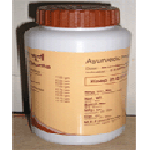

# Divya Panchakol Choorna

**Divya Panchakol Choorna** is a combination of natural herbs that is recommended for arthritis. It is one of the best arthritis alternative treatments that give quick comfort from rigidity of the joints. It is arthritis natural treatment that quickly reduces rigidity and inflammation of the joints. It is an amazing substitute treatment for knee pain relief that improves activity of the muscles and bones and reduces discomfort and inflammation. All the herbs present in this substitute treatment are safe and do not generate any complication. This is a natural arthritis cure that offer nutrition to the joints and assist in regular functioning and activity of the joints.

## Benefits of Divya Panchakol Choorna
1. Divya Panchakol Choorna is useful for discomfort in the joints and muscle tissue. It is one of the best arthritis natural treatments that provides nutrition to the joints and promote their effective functioning.
1. Divya Panchakol Choorna is beneficial for old people who face difficulty in walking due to weakness of the joints.
1. Divya Panchakol Choorna is an amazing product for women who suffer from joint pain due to brittle bones after menopause.
1. Divya Panchakol Choorna provides strength to the bone and muscle tissue and makes them strong for easy movement.
1. Divya Panchakol Choorna is a natural Powder for arthritis cure and provides nutrition to the joints so that they may function normally.
