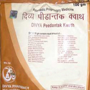

# Divya Pidantaka Kwatha

**Divya Pidantak Kwatha** is a combination of ayurvedic herbs and is found to be an effective remedy for *joint pains* and *arthritis*. ***It consists of natural remedies for arthritis***. It is a natural cure for joint pain and gives quick relief from swelling and stiffness of the joints. The most important benefit of this natural product is that it is safe and does not produce any side effects. This herbal product is recommended for people who wanted to increase strength of their bones and joints. It is a wonderful product suited to people of all ages who are suffering from arthritis and other diseases of the joints.

## Benefits of Divya Pidantak Kwatha
1. Divya Pidantak Kwatha is beneficial for people who suffer from joint pains and other diseases of the bones.
1. Divya Pidantak Kwatha is the best remedy for arthritis. It gives quick relief from pain and stiffness of joints.
1. Divya Pidantak Kwatha helps in reducing inflammation and swelling of joints. It is natural product for getting relief from pain in muscles.
1. Divya Pidantak Kwatha provides strength to the bones and provide them nourishment for optimum functioning.
1. Divya Pidantak Kwatha is a very good product for people during old age when bones become weak due to decreased calcium.
1. Divya Pidantak Kwatha also helps in backache and other body pains. It is recommended for women who suffer from osteoarthritis.
