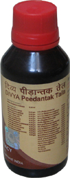

# Divya Pidantaka Taila

[TOC]

Pain is a symptom that accompanies many diseases. People suffering from arthritis, gout, and other joint diseases may have severe pain in their joints. There are different causes of pain.

## Causes of muscle and joint pain
* There are different reasons for muscle and joint pain. One should determine the right cause to get the right treatment. Some of the causes of muscle and joint pain are:
1. It may occur due to an injury to the ligaments and tendons.
1. Joint and muscle pain can also occur due to over use of the muscles and ligaments.
1. Inflammatory diseases such as arthritis, gout, can also cause stiffness and pain in the muscles.
1. Sprain and strain can also produce joint pains.
1. Ageing is a natural process and it can lead to pain in the muscles.

## Benefits of Divya Pidantak tail
1. It is a natural pain reliever and provides immediate relief from pain and stiffness of the joints. This natural remedy supplies the nutrients to the joints and gives relief from pain.
1. It is made up of natural herbs that provide nourishment to the joints. This herbal remedy naturally helps to give relief from pain.
1. It is excellent oil for joint pain because it is made by using traditional herbs. All the herbs found in this natural remedy are useful for the treatment of pain.
1. It is useful for knee arthritis and other joint problems. It helps to build up the strength of the joints by providing proper nutrients.
1. It makes your joints strong. It increases the immunity and energy of the muscles and ligaments.
1. It increases the mobility of the joints. You can easily move your joints by massaging your joints regularly by using this oil.
