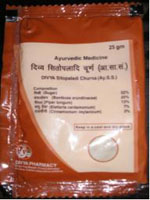

# Divya Sitopaladi Churna

People who want to get best bronchitis remedies should try this herbal product as it is a well known remedy for throat treatment. **Divya Sitopaladi Choorna** is a wonderful product for *coryza*. It is made up of natural herbs that are believed to be excellent herbs for the treatment of respiratory diseases. People suffering from respiratory problems may take this herbal remedy regularly to keep fit and avoid any attack of respiratory infection. The herbs present in this product help to boost up the immunity and prevent recurrent attacks of asthma or bronchitis. It is a very good remedy that may be taken during winters to prevent attacks of cough and cold. It is a safe remedy and does not produce any adverse effects on other parts. It rejuvenates the respiratory organs and boost up energy to fight against recurrent attacks of asthma and other respiratory problems.

Divya Sitopaladi choorna is specially made for the treatment of the respiratory diseases. People who suffer from recurrent attacks of respiratory infection should take this natural and herbal choorna everyday to boost up the immunity. This herbal remedy for bronchitis is a wonderful product as it gives quick relief from symptoms of bronchitis. There are large numbers of bronchitis remedies available in the market that gives temporary relief from the symptoms of bronchitis but Divya Sitopaladi choorna gives permanent relief from cough. It may be taken by people of all ages and for any period of time as it is safe and natural. It helps in the treatment of bronchitis by boosting up the immune system.It helps in eliminating excess of mucus from the respiratory cells and gives quick relief from cough and congestion. It helps in providing energy to the respiratory cells and prevents recurrent attacks. It nourishes the respiratory organs and is a wonderful remedy for whole body system. People who suffer from recurrent attacks of bronchitis should take this natural remedy regularly to prevent signs and symptoms of bronchitis. All the herbs used in this natural herbal product are safe and well known to produce excellent results in all cases of respiratory infections. It is also a wonderful remedy for people who suffer from asthma. It helps to prevent recurrent attacks of asthma. It is also suitable for young children who suffer from asthma as it boost up their immunity and helps in the treatment of asthma.

The herbs present in this Divya Sitopaladi Choorna are beneficial in the throat treatment. Divya Sitopaladi choorna is recommended for digestive problems also. It helps in the treatment of digestive disorders as it helps in boosting up the immunity and provides essential vitamins and minerals to the body for optimum functioning. It not only helps in the treatment of respiratory infections but also is a good remedy for general weakness of the body. It is a good remedy for women who suffer from osteoporosis and weak immunity. It helps in increasing the strength of the body organs for normal functioning. Divya Sitopaladi choorna is a wonderful remedy for old people who suffer from bone and joint problems. It provides essential minerals and vitamins to the whole body for normal functioning.

Thus, Divya Sitopaladi choorna may be taken by people of all ages for the treatment of any problem. It is a general body tonic that provides energy to the body cells.
