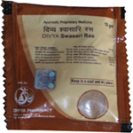

# Divya Swasari Ras

**Divya Swasari Ras** is a combination of organic natural herbs that are combined together to produce an amazing product for difficulty in breathing. It is one of the best natural asthma treatment prepared from the Ayurvedic natural herbs to treat respiratory disease, bronchial asthma, cold, coughing etc. All the herbs in this product are organic and do not have any adverse reactions. It is the best remedy for throat disorders. All the asthma natural remedies in this product are natural and do not produce any side effects.
Divya Swasari Ras is a unique combination of asthma natural remedies that helps in the treatment of all respiratory disorders. It is advised to take this item regularly to get benefit. This item allows the voice to function normally. Breathing becomes active and healthier and free from any diseased condition.

## Benefits of Divya Swasari Ras
1. Divya Swasari Ras improves the resistance of the body and allows in fighting against the diseased condition of the bronchi and the bronchioles.
1. Divya Swasari Ras is also helpful in eliminating the excessive accumulation of the mucous in the chest. It not only helps in eliminating the mucous from the chest but it also helps in stopping the further development of mucous in the chest.
1. Divya Swasari Ras improves the defense mechanisms and stops upcoming strikes of condition. Patient gets rid of all his signs and symptoms forever.
1. Divya Swasari Ras consist of asthma natural remedies that give quick relief from frequent asthmatic attacks. It boosts up the immunity of the body and prevents further attacks in the future.
1. Divya Swasari ras is an effective herbal solution for people suffering from asthma and other respiratory problems.
