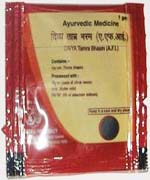

# Divya Tamra Bhasm

**Divya tamra bhasm** is prepared from using the metal copper which acts as a strong anti-oxidant and does not produce any harmful effects. Copper metal is used for the preparation of this ayurvedic remedy for the treatment of various disorders. Divya tamra bhasm is a wonderful herbal remedy for the treatment of leucoderma. This natural remedy is used for the treatment of gastro-intestinal disorders, liver disorders, old age diseases, skin diseases, etc. Copper is required by our body for the formation of bone and effective functioning of nervous system. Deficiency of copper may lead to bone disorders, weight loss, anemia, graying of hair and nervous disorders. Thus, Divya tamra bhasm is a wonderful natural product to fulfill the copper demands of our body. The amount of copper used in this natural remedy is minute and it is used as a medicinal source for the treatment of various diseases. Copper is not used in its raw form but it is converted into other suitable form which may be easily assimilated by our body. This natural remedy is prepared by using various detoxification techniques so that it becomes suitable for clinical use.

## Advantages
Divya tamra bhasm is a natural remedy that does not produce any side effects and it may be taken for longer period of time to achieve its therapeutic effects. Divya tamra bhasm is used for the treatment of various disorders and is absolutely natural and safe. The amount of copper used in this natural product is used in therapeutic doses and does not produce any side effects. Regular intake of Divya tamra bhasm does not produce any side effects and it may be taken by people of all ages. It does not produce any allergic reaction and is a very good natural remedy indicated for various skin diseases. It is known that it does not produce any damage to the body parts when taken regularly. Divya tamra bhasm helps in the growth of normal bones and nerve cells. Divya tamra bhasm helps to complete the deficiency of copper in the body and prevents diseases caused due to deficiency of copper.
