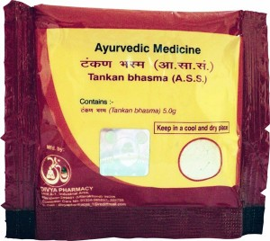

# Divya Tankan Bhasm

**Divya Tankan bhasm **is a combination of natural products and is a very good natural treatment for hair. It is recommended for hair loss, dandruff, premature graying of hair and other hair problems. Divya Tankan bhasm is prepared from ayurvedic herbs and natural bhasm that helps in controlling hair fall and promotes good hair growth. Divya Tankan bhasm is a wonderful natural product that helps to stimulate growth of hair and improves the strength of hair. Divya Tankan bhasm is suited for both men and women and people of all ages. It may be regularly applied to hair after or before washing to get maximum beneficial results. Divya Tankan bhasm is a suitable natural product for all hair diseases. It stops excessive hair fall and prevents formation of dryness. It reduces dryness of the scalp and provides nourishment to the hair cells. Divya Tankan bhasm helps to provide strength to the roots of hair and make them strong and healthy. Divya Tankan bhasm is a natural product and does not produce any side effects when used regularly. Tankan bhasm is known as borax ash and it is an effective natural remedy for various disorders. Tankan bhasm has been traditionally used for the treatment of various diseases in body.

## Advantages
Divya Tankan bhasm is a natural product and does not produce any side effects. It has been used for a long time for the treatment of different ailments but is not known to produce any side effects. Divya Tankan bhasm may be taken by people of any age for a longer period of time as it does not produce any allergic reaction. Divya Tankan bhasm may be taken for prolonged period of time as it provide nourishment to the hair cells and help in healthy growth of hair. Divya Tankan bhasm is a natural remedy for boosting energy and it is also a very good remedy for general weakness. It provides strength and support to normal functioning of all the organs. Divya Tankan bhasm does not produce any adverse effects on the body. It provides natural nourishment to body cells. People suffering from any kind of hair problem may take this natural product to get healthy hair.
