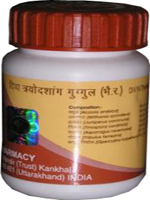

# Divya Trayodashang Guggulu

**Divya Trayodashang Guggulu** is a unique herbal remedy for cervical spondylosis treatment. Guggulu is a well know herb that is used since ancient times. It is the best treatment for lower back pain as it gives immediate relief. It is absolutely safe and nourishes the muscles and tissues of the back naturally. If you are looking for a cure for lower back pain you should use Divya Trayodashang Guggulu. It has given excellent results in the cervical spondylosis treatment. There are many people who suffer from lower back pain and do not find any natural solution for their problem. They have to take painkillers and other harmful drugs that produce large number of side effects. You may find numerous treatments for lower back pain in the market but this herbal product is believed to give excellent results in chronic cases of lower back pain. It is absolutely safe and do not produce any unwanted effects even if taken for a long time.

## Benefits of Divya Trayodashang Guggulu
1. Divya Trayodashang Guggulu is a wonderful remedy for the treatments for lower back pain. People suffering from lower back pain may take this herbal remedy to get rid of their lower back pain.
1. Divya Trayodashang Guggulu is also a beneficial herbal solution for cervical spondylosis treatment. In allopathic medicine there is no cure for cervical spondylosis but this remedy is a real cure for lower back pain and cervical spondylosis without producing any adverse reactions.
1. Divya Trayodashang Guggulu is a useful remedy for the people suffering from pain in muscles of back. It provides strength to the muscles of the back and gives quick relief from back pain.
1. Divya Trayodashang Guggulu provides nourishment to the cells and tissues of back to increase their strength and giving quick relief from pain and stiffness.
1. Divya Trayodashang Guggulu also helps in the treatment of sciatica in men and women. Regular intake of this herbal remedy reduces swelling and gives immediate relief from stiffness of the leg.
1. Divya Trayodashang Guggulu is a useful remedy for back pain that may occur due to any reason. It mainly helps to boost up the strength for optimum functioning of the muscles of the back.
