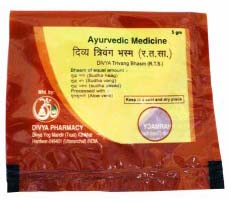

# Divya Tribang (Trivanga) Bhasm

**Divya Tribang bhasm** is a combination of three metals lead, tin and zinc. It is a wonderful natural remedy that provides support to the body and helps in recovering from physical weakness due to prolonged disease. Divya Tribang bhasm nourishes the body cells in helps in providing strength to the body. Tribang bhasm is a combination of three different metals that are known for their healing properties. These three metals are used in very low amount to prepare a wonderful remedy for general weakness of the body. Divya Tribang bhasm provides essential minerals and nutrients to the body cells and boost up energy. Divya Tribang bhasm is a natural remedy and increases the physical strength of the body parts. Divya Tribang bhasm is a wonderful herbal product that is recommended to correct the general fatigue and weakness. Divya Tribang bhasm helps in promoting the strength and nourishing the body tissues and cells. Divya Tribang bhasm is a very good tonic for old people and women suffering from general weakness due to loss of blood during monthly menstrual cycle. Person who feels weak and tired after doing physical labor may take this natural health supplement to increase strength of the body.

## Advantages
Divya Tribang bhasm is made up of natural ingredients and is recommended for general fatigue and weakness. All the metals and other natural herbs used in this product do not produce any side effects and may be taken by people of any age. Divya Tribang bhasm may be taken for a longer period of time to get energy and it also helps to boost up the immunity against infectious diseases. Divya Tribang bhasm is a general tonic for your body and provides strength to the bones and muscles to work in an efficient manner. Divya Tribang bhasm increases the lost strength and vigor after a prolonged illness of surgery. It provides natural nutrients to the body that are required to build up the strength of muscles and tissues. Divya Tribang bhasm helps to increase body stamina and it may be taken to increases physical strength.
