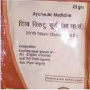

# Divya Trikatu Choorna (Powder)

Divya Trikatu Choorna is a combination of natural herbs that are found to be effective for asthma, rhinitis, coryza and sinusitis. It is found to be a blend of ayurvedic herbs and gives quick relief from respiratory disorders. All the remedies in this product are natural and safe and do not produce any adverse reactions. This natural treatment for asthma is believed to be useful in increasing the immunity of the body to prevent recurrent attacks of respiratory infections. Divya Trikatu Choorna is the best natural remedy asthma and it increases the strength of the respiratory organs to fight against the recurrent attacks of asthma. People suffering from chronic asthma may start taking this product made up of asthma herbal remedies to get permanent cure. Divya Trikatu Choorna consists of best asthma herbal remedies and it boosts up the immune system to provide quick relief from asthmatic attacks. This natural treatment for asthma is safe for prolonged use and do not produce any side effects. It may be taken by individuals of any age who suffer from asthma, chronic coryza, sinusitis, etc.

## Benefits of Divya Trikatu Choorna
1. This remedy is the best natural treatment for asthma and is recommended for recurrent attacks
1. It is beneficial for the people with weak immunity that get recurrent attacks of asthma.
1. People who suffer from coryza and sinusitis may take this remedy to get quick relief.
1. Divya Trikatu Choorna is a wonderful herbal remedy that helps in the treatment of all respiratory problems without producing any harmful effects.
1. Divya Trikatu churna is believed to be useful in boosting up the immunity by giving natural herbal nutrients to the respiratory cells.
1. It may be taken regularly for increasing the strength of the respiratory organs and giving quick relief in all respiratory symptoms.
1. Divya Trikatu Churna not only helps in the treatment of respiratory problems but it is also a wonderful remedy for the treatment of stomach disorders.
1. It is also recommended for people who suffer from flatulence, indigestion, vomiting, constipation or diarrhea.
