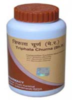

# Divya Triphala Churan For Constipation

Divya Triphala Churna is an ideal combination of natural therapies for the treatment of constipation and other digestive disorders. It is a unique blend of chosen ayurvedic herbs that helps in natural constipation cure. This herbal remedy is a natural colon cleanser. There are different remedies available in the market for cleansing of the body system but this herbal product is believed to be one of the best colon cleansers. The herbs present in this product are well known for their action on the digestive system. People suffering from chronic constipation and other digestive complaints should take this natural remedy for the cleansing of their body. This is a unique blend of Herbal remedies that help in natural constipation cure. There are many natural colon cleansers available in the market but this is believed to be the best colon cleansers as it consists of all natural herbs which are safe and help to strengthen the digestive system by providing best nutrients. As the name indicates this herbal product consists of three natural herbs that are considered to be the best remedies for digestive ailments.

## Benefits of Divya Triphala Churan
1. Divya Triphala Churna is beneficial for people who suffer from long standing digestive problems. This herbal product is a very good combination of herbs that helps in natural constipation cure.
1. Divya Triphala Churna is a wonderful herbal product for the treatment of digestive diseases such as flatulence, pain in the abdomen, vomiting, diarrhea, etc.
1. Divya Triphala Churna is a natural colon cleanser and it helps in cleansing of body system by eliminating waste products quickly from the body.
1. Divya Triphala Churna is considered to be one of the best colon cleansers that help to remove toxic substances from the body and gives quick relief from pain and flatulence.
1. Divya Triphala Churna is a safe and natural product for digestive diseases and it helps to provide essential nutrients to the body for stimulating digestive organs for optimum functioning.
1. Divya Triphala Churna also helps to improve appetite. People suffering from loss of appetite may take this natural remedy to improve appetite.
1. Divya Triphala Churna may be taken regularly for normal functioning of the digestive organs.
Therapeutic Uses
1. Divya Triphala Churna is a natural colon cleanser and it helps in the removal of waste and toxic substances from the body.
1. Divya Triphala Churna is recommended for the treatment of all digestive diseases. All the herbs in this churna are safe and effective and produce excellent results within short period of time.
1. Divya Triphala Churna stimulate the functioning of the digestive system so that natural cleansing of the colon may take place.
1. Divya Triphala Churna is beneficial for liver dysfunction. People suffering from liver ailments may also take this remedy to get rid of their problems.
1. Divya Triphala Churna also helps in the treatment of respiratory organs as it helps in removing mucus from the respiratory tract.
