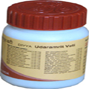

# Divya Udaramrita Vati

[TOC]

Divya Udaramrita Vati is a combination of natural herbs and helps in stomach problems. It is a wonderful combination of natural remedies that helps in the treatment of digestion problem. Divya Udaramrita Vati helps in the treatment of digestive disorders naturally. It is recommended for all the digestive ailments. It helps to relieve indigestion, acidity, heartburn, etc. It helps to give quick relief from digestive disorders. It helps to stimulate normal functioning of the liver. It gives relief from constipation and diarrhea. Divya Udaramrita Vati is a combination of traditional ayurvedic herbs that are found to be useful for digestive disorders. This natural herbal remedy supports normal functioning of the digestive organs. It helps in balancing the pH and gives quick relief from acidity. It helps in proper digestion of the food and relieves flatulence. It is a very good herbal remedy for chronic constipation. It helps in the treatment of piles and inflammation of the gastric mucosa.

## Benefits of Divya Udaramrita Vati
Divya Udaramrita Vati helps in the treatment of stomach problems. It increases appetite and helps to cure abdominal pain.
Divya Udaramrita Vati helps to cure abdominal pain. It is a very good remedy for diarrhea and constipation.
Divya Udaramrita Vati gives quick relief from flatulence, vomiting, nausea, indigestion, etc.
Divya Udaramrita Vati is a wonderful natural remedy for giving relief from digestive disorders quickly.
Divya Udaramrita Vati gives relief from acidity, heartburn and other digestive ailments.
Divya Udaramrita Vati helps in increasing appetite, improves digestive functions, and liver disorders.

## Therapeutic uses
1. Divya Udaramrita Vati is a wonderful remedy for digestive disorders.
1. Divya Udaramrita Vati is helpful for acute and chronic problems of digestive system. It helps in the treatment of liver disorders, acidity, heartburn, constipation, diarrhea, etc.

## Direction of use:
1. Divya Udaramrita Vati is to be taken two times in a day after breakfast and dinner with lukewarm water or milk.
One to two tablets should be taken two times in a day.

## How long to take it?
1. Divya Udaramrita Vati is made up of natural herbs that help in the stomach disorders. It is a wonderful remedy for all the digestive disorders. It may be taken regularly for normal functioning of the digestive system.
