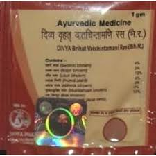

# Divya V.V.Chintamani Ras

This natural herbal remedy is recommended for all kinds of neurological disorders. It is a blend of natural herbs that helps in the treatment of neurological disorders. Divya V.V. Chintamani ras has been used for ages for the improvement in functions of nerves and muscles. It helps to provide strength to muscles and nerves. Divya V.V. Chintamani ras provides nutrients to the nerves for optimum functioning. It supports normal functioning of motor and sensory nerves. It also helps to calm the brain and relieves from stress and tension. In today’s life every person is suffering from stress and tension due to one reason or the other. Divya V.V. Chintamani ras helps to provide nourishment to brain cells and calm mind. Divya V.V. Chintamani ras is a wonderful natural herbal remedy that provides nourishment to the brain and supports normal functioning of all body parts. Divya V.V. Chintamani ras also helps to improve memory and concentration. Divya V.V. Chintamani ras also prevents paralysis that may be produced due to weakness of nerves. Divya V.V. Chintamani ras provides essential nutrients to the brain and makes nervous system strong and healthy.

## Advantages
Divya V.V. Chintamani ras is a combination of time tested ayurvedic herbs that does not produce any side effects and is a very good brain tonic. It not only helps to support nervous system but also helps to support normal functioning of the muscles of the heart. Divya V.V. Chintamani ras is also a very good product for heart and is an effective remedy for increasing muscle tone and nerve strength. This natural herbal remedy does not produce any allergic reaction as the herbs used in this product are natural and do not have any side effects. Divya V.V. Chintamani ras may be taken at any age and is absolutely natural and safe. It is a very good natural herbal remedy that is best after surgery or some major accident. Divya V.V. Chintamani ras helps in rapid healing of the muscles and injured tissues. Divya V.V. Chintamani ras provides essential nutrients to the brain cells and release stress hormones to cope with stress and tension quickly.
