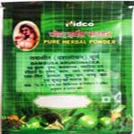

# Divya Vanshlochan

Divya Vanshlochan is a comprehensive herbal ayurvedic remedy for generalized weakness and loss of strength. It is a wonderful herbal tonic for providing strength to the muscles and all body parts. Divya Vanshlochan helps in providing strength in diabetic people, after surgery and weakness experienced after night fall. It is a very good natural product for general debility and increases strength by providing nutrients to body cells. Divya Vanshlochan rejuvenates the body cells and increases internal power to cope up with weakness and debility. Divya Vanshlochan may be taken by women who feel weak and tired due to loss of blood during menstrual period. Divya Vanshlochan is recommended for people who suffer from chronic diseases and feel weak and tired. Divya Vanshlochan helps to boost up energy and immunity of the body to fight against chronic diseases. It provides strength to the muscles and bones for normal functioning. People suffering from recurrent attacks of fever and other infectious diseases may take this natural product to increase the body strength.

## Advantages
Divya Vanshlochan is indicated for generalized body weakness in chronic diseases such as diabetes, asthma, tuberculosis, recurrent night falls etc. It acts as a tonic for the whole body and does not produce any harmful effects. All the herbs used in Divya Vanshlochan are natural and are traditionally known to increase the body strength by providing nutrients to the body cells. Divya Vanshlochan may be regularly taken by weak and emaciated people to fight against recurrent attacks of infectious diseases. Divya Vanshlochan is also helpful in increasing body strength after major surgery. It helps to attain lost strength and energy. Regular intake of this natural tonic helps vital organs to function normally and effectively. Divya Vanshlochan is a natural tonic that provides nourishment to heart, liver, nervous system and other organs of the body. Divya Vanshlochan may be taken by people of any age and it is not known to produce any adverse effects on the body.
Indications
