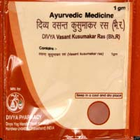

# Divya Vasant Kusumakar Ras

**Divya vasant kusumakar** ras is a combination of herbal remedies and is a useful natural product for diabetes and general weakness of the body. It is a natural herbal remedy and helps in the treatment of diabetes naturally. This combination of different herbs provides natural immunity to the body and boost up the energy. Weak and emaciated people can take this natural remedy to boost up the energy. Divya vasant kusumakar ras is also recommended for sexual problems in men. It provides strength to the sexual organs for normal functioning. Divya vasant kusumakar ras acts as a general tonic. It helps in repairing the diseased cells to promote natural healing. The herbs present in this natural remedy are traditionally believed to provide essential nutrients to the body cells. The nutrients present in Divya vasant kusumakar ras help in repairing old and worn out cells. It is recommended for general weakness and debility. Diabetes is a medical condition produced by deficiency of insulin hormones produced by pancreatic cells. Diabetes leads to general weakness of the body parts. Divya vasant kusumakar ras provides natural nourishment to the body cells and help in the treatment of weakness caused by diabetes.

## Advantages
Divya vasant kusumakar ras is a blend of natural ayurvedic herbs and does not produce any side effects. It is an effective natural remedy for the treatment of diabetes, sexual disorders and general body weakness. Divya vasant kusumakar ras is a natural rejuvenating remedy that provides energy to body cells and is useful in heart diseases as well as other debilitating diseases. Divya vasant kusumakar ras is a very good natural product for the treatment of sexual debility in men. Divya vasant kusumakar ras consists of natural herbs that do not produce any side effects. It may be taken regularly for the treatment of body weakness and controlling blood sugar. Divya vasant kusumakar ras may be taken along with other diabetic remedies as it does not produce any interaction of herbs with other remedies. Regular intake of Divya vasant kusumakar ras boosts up the body immunity and provides energy to body cells for better performance.
