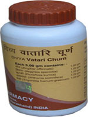

# Divya Vatari Churna (Powder)

**Divya Vatari Churna** is a combination of natural herbs that is recommended for arthritis. It is one of the best arthritis herbal remedies that give quick relief from pain and stiffness of the joints. It is a natural powder for arthritis that quickly relieves stiffness and swelling of the joints. It is a wonderful alternative medicine for arthritis that increases movement of the joints and relieves pain and swelling. All the natural herbs present in this alternative medicine are safe and do not produce any side effect. These herbs provide nutrition to the joints and support normal functioning and movement of the joints.

## Benefits of Divya Vatari Churna
1. Divya Vatari Churna is useful for pain in the joints and muscles. It is one of the best arthritis herbal remedies that provides nutrients to the joints and promote their effective functioning.
1. Divya Vatari Churna is beneficial for old people who face difficulty in walking due to weakness of the joints.
1. Divya Vatari Churna is a wonderful product for women who suffer from joint problems due to osteoporosis after menopause.
1. Divya Vatari Churna provides strength to the bones and muscles and make them strong for easy movement.
1. Divya Vatari Churna is a herbal Powder for arthritis and provides essential nutrients to the joints so that they may function normally.
