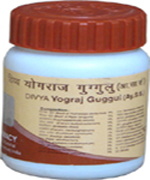

# Divya Yograj Guggulu For Arthritis

Divya Yograj Guggulu is a traditional herb which is indicated for natural cures for arthritis. All the remedies for joint pain available in the market may produce adverse effects but this herb is known for its wonderful effect in the natural cure for arthritis. Guggulu is a well known traditional herb that is used to strengthen the joints and give relief from stiffness. There are many people who look for remedies for joint pain but do not find real arthritis cure. Divya Yograj Guggulu is proved to be an effective remedy for arthritis cure as it has given excellent results to ease the pain. people who take pain killers or muscle relaxants to get rid of their suffering should take this natural herbal remedy to increase strength of their joints and facilitate easy movement. It is very difficult to get permanent cure for arthritis by using pain killers. It gives temporary relief but this herbal remedy gives permanent relief from pain of the joints.

## Benefits of Divya Yograj Guggulu
1. Divya Yograj Guggulu is recommended for joint problems that may occur at any age. It is a beneficial remedy to boost up the strength of the joints without producing any adverse effects.
1. Divya Yograj Guggulu is useful remedy to relieve pain of the muscles of back or any other part of the body naturally.
1. Divya Yograj Guggulu is recommended for people who are prone to develop joints problems due to hereditary factors.
1. Divya Yograj Guggulu is beneficial for diseases of the joints and pain in any part of the body. It provides herbal nutrients to the muscles and joints to increase their strength.
1. Divya Yograj Guggulu is suitable for people of all age suffering from bone diseases as it is safe and consists of herbal remedies.
