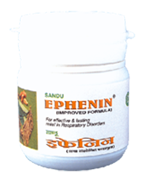

# Ephenin

A research product from the House of Sandu containing Somlata and Shwaskuthar Ras. It is highly recommended for bronchial asthma and such other difficult respiratory disorders. Offered in convenient tablet form.
