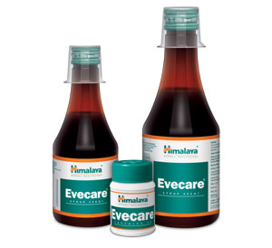

# Evecare

**Evecare** repairs the endometrium (inner membrane of the uterus), regularizes endogenous hormonal secretion, corrects the cyclical rhythm and relieves the symptoms of dysfunctional uterine bleeding. It is also a hemostatic that stops heavy bleeding.

**Pain relief**: The antispasmodic and anti-inflammatory properties of Evecare are helpful in alleviating pain during menstruation or menstrual disorders.

**Hematinic**: Evecare stimulates the immune system and helps in increasing the level of hemoglobin in the blood. This action is beneficial in treating anemia and weakness associated with uterine disorders.

**Improves fertility**: Hormones known as gonadotropins are responsible for regulating follicle maturation, ovulation and normalizing estrogen and progesterone levels. Gonadotropins are important to the system that regulates normal growth, sexual development and reproductive function. Evecare improves fertility by normalizing these hormone levels.

## Key ingredients
**Ashoka Tree** (Ashoka) has potent estrogenic properties, which repair the endometrium, regulate estrogen levels and help heal the inflamed endometrium during menstruation.

**Asparagus** (Shatavari) restores hormonal balance in women with fluctuating hormonal levels as a result of menstruation and menopause. It is also a popular herb that enhances fertility, and regulates the menstrual cycle and relieves symptoms of premenstrual syndrome (PMS). Asparagus also reduces the inflammation of sexual organs and is known to enhance sex drive in women.

**Lodh Tree** (Lodhra) improves fertility by regulating ovarian hormones.

**Malabar Nut** (Vasaka) has effective anti-inflammatory and analgesic properties, which relieve pain during dysmenorrhea.
