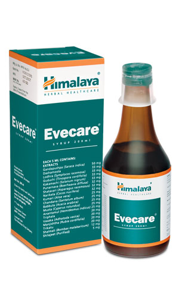

# Evecare syrup

[TOC]

## Key ingredients
* Ayurveda texts and modern research back the following facts:

* Ashoka Tree ([Ashoka](Ashoka.md)) has potent estrogenic properties, which repair the endometrium, regulate estrogen levels and help heal the inflamed endometrium during menstruation.

* Lodh Tree ([Lodhra](Lodhra.md)) improves fertility by regulating ovarian hormones.

* Asparagus ([Shatavari](Shatavari.md)) restores hormonal balance in women with fluctuating hormonal levels as a result of menstruation and menopause. It is also a popular herb that enhances fertility, and regulates the menstrual cycle and relieves symptoms of premenstrual syndrome (PMS). Asparagus also reduces the inflammation of sexual organs and is known to enhance sex drive in women.

* Malabar Nut ([Vasaka](Vasaka.md)) has effective anti-inflammatory and analgesic properties, which relieve pain during dysmenorrhea.

## Directions for use
* Please consult your physician to prescribe the dosage that best suits your condition.

## Side effects
* Evecare is not known to have any side effects if taken as per the prescribed dosage.

## References

## References

1. Products of the Himalaya Drug Company
