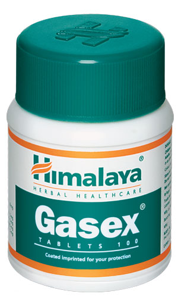

# Gasex

[TOC]

**Gasex Tablet** renormalizes the intestinal transit time. Gasex tablet has prebiotic, antiflatulent and antacid, antiulcer, anti-inflammatory, hepatoprotective, cholagogue and membrane-modulating, antimicrobial, and antioxidant actions.

**Gasex Tablet** exerts carminative and antispasmodic actions that support the digestive function.

## Directions for use
Please consult your physician to prescribe the dosage that best suits the condition.

## List of Ayurvedic herb in which used in this preparation
[Zingiber officinale](../../herbs/Zingiber_officinale.md)
