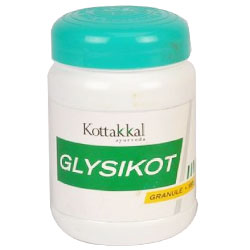

# Glysikot Granule

[TOC]

This unique herbal combination helps to manage diabetes. This could be used as an adjuvant remedy in diabetic related complications effectively. Glysikot granule is a combination of 5 well known anti-diabetic herbs. This unique herbal formulation helps to manage diabetic symptoms using a multi prong approach.

## Indication for use of Glysikot Granule
* Diabetic conditions

## Each 5g Glysikot Granule is prepared out of
* Amrita (Tinospora cordifolia) - 0.416g
* Abhaya (Terminalia chebula) - 0.416g
* Dhatri (Phyllanthus emblica) - 0.833g
* Ratri (Curcuma longa) - 0.833g
* Meharimula (Salacia reticulate) - 2.5g
