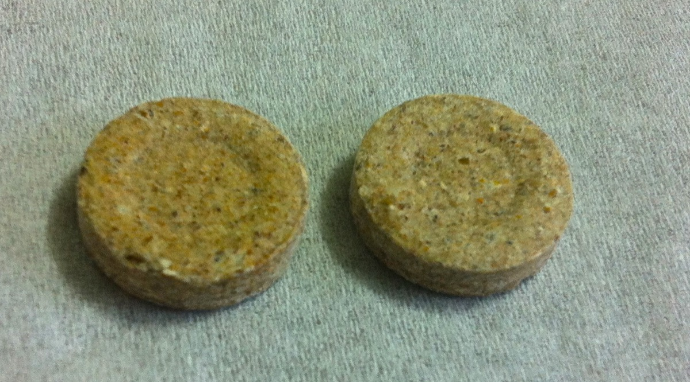

# Hajmola

Hajmola is a digestive tablet manufactured by Dabur in India and Hilal in Pakistan. It consists of a variety of traditional Ayurvedic herbs and is supposed to control dyspepsia, ease in digestion and control flatulence. Hajmola comes in five flavours: Original, Nimbu Lemon Imli Tamarind, Pudina Peppermint and Anardana Pomegranate. The tablets are packed and marketed in the form of sachets or bottles. It also consists of black pepper.

Hajmola Candy is a small sweet which is intended to perform the same function as Hajmola tablets. It comes in several flavours including Aalbela Aam and Chulbuli Imli.It is also a very popular among children in India. This product is also sold in Nepal also sold in the USA and Australia in some Indian supermarkets and it can also be found in Canada, in some Indian stores.
