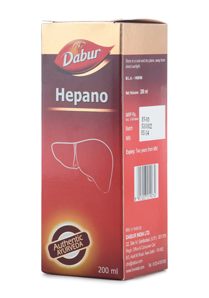

# Hepano

Dabur Hepano makes your liver healthier by protecting it from various hepatotoxins. Hepatotoxins are chemicals such as heavy metals, synthetic chemicals etc., which can cause liver damage.

Why use Dabur Hepano?

* Keeps  liver healthy
* Protects liver from damage caused by hepatotoxins
* Made using natural herbs such as Bhumiamlaki, Guduchi etc.

## Key Ingredients
Bhumiamlaki, Guduchi, Nimba, Haritaki, Kalmegh
