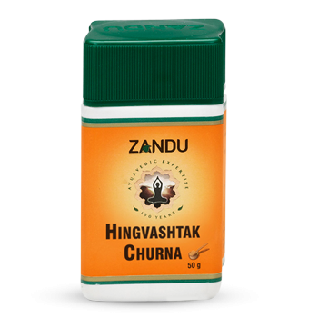

# Hingwashtak Churna

[TOC]

Used for centuries as household remedy to treat stomach ailments to maintain proper function of the gastrointestinal tract. Primarily used for eliminative functions such as defecation, Micturition, flatulence.
Excellent medicine gas, indigestion, constipation and other common problems associated with poor metabolism.
Saindhava lavan (edible salt) used in the formulation helps in digestion by softening food and aiding secretion of digestive juices. Hingu is instantly effective on flatulance.

## Composition
Shunthi (Zingiber officinale). Saindhav lavan(Rock salt) Kalimaricha (Black Pepper). Jira Safed (Cumin) Pippali (Piper longum). kala Jira (Black cumin). Ajwain (Carum couticum). Hingu (Asafoetida Resin).

## Dosage
1 to 4 g to be taken before, with or after food depending on the ailment or as directed by physician.

* Carminative & gastric stimulant. significant in flatulence, dyspepsia, colic, constipation.
Ease in detention of gas in intestine. Enkindles the appetite and enhances digestion. Stimulates healthy and unobstructed peristalsis. Balances downward moving energies.
